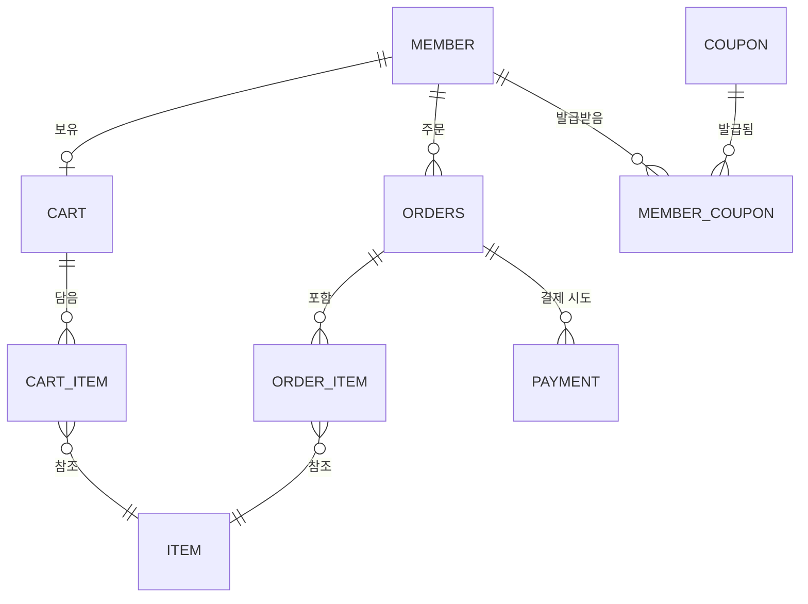

# 🛒 Home Shopping Backend

대량 동시 요청(선착순 쿠폰 발급, 한정 수량 주문)에도 안정적으로 동시성을 제어하는 것을 목표로 하는 Spring Boot 기반 이커머스 백엔드입니다.

---

## 기술 스택

| 분류 | 기술 |
|---|---|
| Language | Java 21 |
| Framework | Spring Boot 4.0.2 |
| Security | Spring Security, JWT (jjwt 0.11.5) |
| Database | H2 (개발/테스트, in-memory) — PostgreSQL 드라이버 포함(운영 전환 예정) |
| ORM | Spring Data JPA / Hibernate |
| Cache / 동시성 제어 | Redis |
| Build | Gradle |
| Etc | Lombok |

---

## 주요 기능

- **회원**: 회원가입 / 로그인(JWT) / 회원정보 조회·수정
- **상품**: 목록/상세 조회, 등록·수정·삭제(ADMIN), Redis 캐싱
- **장바구니**: 상품 추가 / 조회 / 삭제
- **주문**: 주문 생성(결제 대기 상태로 생성) / 목록·단건 조회 / 취소
- **결제**: 결제 요청 생성 → 승인 확정(재고 차감은 이 시점에 발생) → 조회 / 취소
- **쿠폰**: 선착순 쿠폰 발급(Redis SET + INCR 기반 동시성 제어) / 내 쿠폰 목록 조회

---

## 패키지 구조

각 도메인이 `domain / application / infrastructure / presentation` 4계층 구조를 동일하게 반복합니다.

- `com.shop.backend.auth` — 회원가입/로그인
- `com.shop.backend.member` — 회원 정보
- `com.shop.backend.Item` — 상품
- `com.shop.backend.cart` — 장바구니
- `com.shop.backend.order` — 주문 (결제 대기/완료/취소/실패 상태 관리)
- `com.shop.backend.payment` — 결제 (Payment 엔티티, 결제 승인 흐름)
- `com.shop.backend.coupon` — 선착순 쿠폰
- `com.shop.backend.config` — Redis 등 공통 설정
- `com.shop.backend.global` — JWT, 예외 처리, 시큐리티 설정

  ---

## 핵심 설계 — 동시성 제어

| 자원 | 방식 | 이유 |
|---|---|---|
| 재고(Item) | 비관적 락(`PESSIMISTIC_WRITE`, 3초 타임아웃) | 재고 차감은 트랜잭션 일관성이 중요한 최종 소스오브트루스라 DB에서 처리 |
| 쿠폰 발급 수량 | Redis `SET`(중복 발급 체크) + `INCR`(수량 체크) | 스파이크성 트래픽을 DB 커넥션 풀 대신 Redis에서 흡수, 실패 시 보상(rollback) 처리 |
| 쿠폰 발급 통계(`issuedQuantity`) | DB 원자적 `UPDATE` 쿼리 (`SET issuedQuantity = issuedQuantity + 1`) | 엔티티 dirty-checking 방식은 동시 갱신 시 Lost Update 발생 — 원자 연산으로 전환 |

**재고 차감 시점**: 주문 생성 시점이 아니라 **결제 확정(`PaymentService.confirm()`) 시점**에 발생합니다. 주문은 일단 `PENDING` 상태로 생성되고, 결제 승인이 확정될 때 비관적 락을 걸고 실제 재고를 차감합니다.

---

## API 명세

### Auth (`/api/auth`) — 인증 불필요
| Method | URL | 설명 |
|---|---|---|
| POST | /api/auth/signup | 회원가입 |
| POST | /api/auth/login | 로그인 (JWT 발급) |

### Member (`/api/members`) — 인증 필요
| Method | URL | 설명 |
|---|---|---|
| GET | /api/members/{id} | 회원 정보 조회 |
| PUT | /api/members/{id} | 회원 정보 수정 |

### Item (`/api/items`)
| Method | URL | 설명 | 권한 |
|---|---|---|---|
| GET | /api/items | 전체 상품 조회 | 누구나 |
| GET | /api/items/{id} | 상품 상세 조회 | 누구나 |
| POST | /api/items | 상품 등록 | ADMIN |
| PUT | /api/items/{id} | 상품 수정 | ADMIN |
| DELETE | /api/items/{id} | 상품 삭제 | ADMIN |

### Cart (`/api/cart`) — 인증 필요
| Method | URL | 설명 |
|---|---|---|
| POST | /api/cart | 장바구니 상품 추가 |
| GET | /api/cart | 장바구니 조회 |
| DELETE | /api/cart/{itemId} | 장바구니 상품 삭제 |

### Order (`/api/orders`)
| Method | URL | 설명 |
|---|---|---|
| POST | /api/orders | 주문 생성 (PENDING 상태) |
| GET | /api/orders?memberId={id} | 회원 주문 목록 조회 |
| GET | /api/orders/{id} | 주문 단건 조회 |
| DELETE | /api/orders/{id} | 주문 취소 (결제완료 건만 재고 복구) |

### Payment (`/api/payments`)
| Method | URL | 설명 |
|---|---|---|
| POST | /api/payments | 결제 요청 생성 |
| POST | /api/payments/{paymentKey}/confirm | 결제 승인 확정 (재고 차감 발생) |
| GET | /api/payments/{paymentKey} | 결제 상태 조회 |
| POST | /api/payments/{paymentKey}/cancel | 결제 취소 |

### Coupon (`/api/coupons`)
| Method | URL | 설명 |
|---|---|---|
| POST | /api/coupons | 쿠폰 생성 |
| POST | /api/coupons/{couponId}/issue | 선착순 쿠폰 발급 |
| GET | /api/coupons/my | 내 쿠폰 목록 조회 |

---

## ERD



---

## 실행 방법

```bash
# Redis 실행 (쿠폰/캐시 기능에 필요)
docker run -p 6379:6379 redis

# 애플리케이션 실행
./gradlew bootRun
```

`application.yml` 기본 설정: H2 in-memory DB (`ddl-auto: create`), Redis `localhost:6379`.

---

## 테스트

동시성 검증 테스트가 `src/test/java` 에 있습니다.

```bash
./gradlew test --tests OrderConcurrencyTest
./gradlew test --tests CouponServiceTest
```

`CouponServiceTest`는 로컬 Redis가 떠 있어야 통과합니다.

---

## 알려진 이슈 / TODO

- [ ] `OrderConcurrencyTest`가 결제 확정 시점으로 재고 차감 로직이 이동한 이후 더 이상 실제 동작을 검증하지 못함 — `PaymentService.confirm()` 기준으로 재작성 필요 (최우선)
- [ ] `PaymentController`의 `/{paymentKey}/comfirm` 경로 오타 (`confirm`으로 수정 필요)
- [ ] `OrderService.order()`의 재고 체크가 `<=`로 되어 있어 재고와 요청 수량이 정확히 같을 때 잘못 거부되는 off-by-one 버그
- [ ] `POST /api/coupons`(쿠폰 생성)에 ADMIN 권한 체크 없음
- [ ] `SecurityConfig`에 `/api/payments/**` 명시적 인증 규칙 없음 (현재는 catch-all로만 걸림)
- [ ] 실제 PG(결제대행사) 연동 없음 — 현재 `confirm()`은 클라이언트가 보낸 금액만 검증, 서버-to-서버 승인 검증 없음
- [ ] 재고 부족으로 결제 실패 시 PG 환불 처리 미구현
- [ ] Redis `SET add` + `INCR`이 별도 명령이라 완전한 원자성은 없음 (Lua 스크립트로 개선 가능, 낮은 우선순위)
