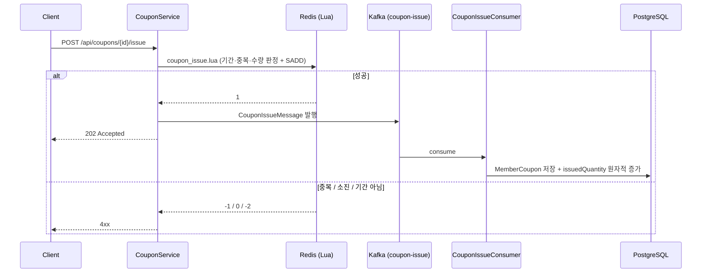
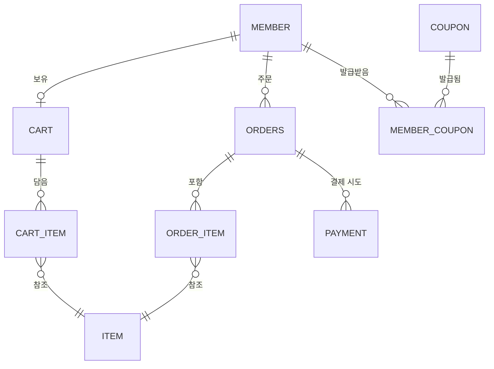

# 🛒 Home Shopping Backend

선착순 쿠폰 발급, 한정 수량 결제처럼 **대량 동시 요청이 한 자원에 몰리는 상황**에서도 데이터 정합성을 지키는 것을 목표로 한 Spring Boot 기반 이커머스 백엔드입니다.
기능 구현보다 동시성 문제를 직접 재현하고(JUnit 동시성 테스트, k6 부하 테스트) 원인을 진단해 단계적으로 개선하는 데 집중했습니다.

- Frontend: [shyuk113/home-shopping-frontend](https://github.com/shyuk113/home-shopping-frontend)
- 배포 가이드: [DEPLOY.md](./DEPLOY.md) · 인프라 구성: [INFRASTRUCTURE.md](./INFRASTRUCTURE.md)

---

## 기술 스택

| 분류 | 기술 |
|---|---|
| Language | Java 21 |
| Framework | Spring Boot 4.0.2, Spring Data JPA / Hibernate |
| Security | Spring Security, JWT (jjwt 0.11.5), BCrypt |
| Database | PostgreSQL 16 (local / prod), H2 (기본 프로필·테스트) |
| Cache | Redis 7 — Spring Cache(`@Cacheable`) 상품 캐싱 |
| 동시성 제어 | Redis Lua Script (선착순 판정), DB 원자적 UPDATE (재고·발급 수량) |
| Messaging | Apache Kafka 3.9 — 쿠폰 발급 DB 저장 비동기화, DLT |
| Infra | Docker, Docker Compose, AWS EC2, Nginx |
| Test | JUnit 5, ExecutorService / CountDownLatch, k6 |
| Build | Gradle |

---

## 주요 기능

- **인증 / 회원**: 회원가입(BCrypt, 이메일 중복 체크), 로그인(JWT 발급), 회원 정보 조회·수정
- **상품**: 목록·상세 조회(Redis 캐싱), 카테고리별 페이징 조회, 등록·수정·삭제(ADMIN), 변경 시 캐시 무효화
- **장바구니**: 상품 추가(이미 담긴 상품이면 수량 합산), 조회, 삭제
- **주문**: 주문 생성(`PENDING`), 목록·단건 조회, 취소(결제 완료 건은 재고 복구)
- **결제**: 결제 요청 → 승인 확정(**이 시점에 재고 차감**) → 조회 / 취소, Redis 기반 결제 실패 급증 감지
- **쿠폰**: 쿠폰 생성, Redis Lua + Kafka 기반 선착순 발급, 내 쿠폰 조회

---

## 아키텍처

### 패키지 구조

각 도메인이 `domain / application / infrastructure / presentation` 4계층을 동일하게 반복합니다.

```
com.shop.backend
├── auth        회원가입 / 로그인
├── member      회원 정보
├── Item        상품 (Redis 캐싱)
├── cart        장바구니
├── order       주문 (PENDING / 결제완료 / 취소 / 실패)
├── payment     결제 승인 흐름, 결제 실패 모니터링
├── coupon      선착순 쿠폰 (Lua 판정 + Kafka Producer / Consumer)
├── common      BaseEntity, Address 등 공통 임베디드 타입
└── global
    ├── config      Security, Redis, Kafka 에러 핸들러, Lua 스크립트 빈
    ├── jwt         JwtProvider, JwtAuthenticationFilter
    └── exception   GlobalExceptionHandler, 커스텀 예외
```

### 선착순 쿠폰 발급 흐름


```mermaid
sequenceDiagram
    participant C as Client
    participant API as CouponService
    participant R as Redis (Lua)
    participant K as Kafka (coupon-issue)
    participant W as CouponIssueConsumer
    participant DB as PostgreSQL

    C->>API: POST /api/coupons/{id}/issue
    API->>R: coupon_issue.lua (기간·중복·수량 판정 + SADD)
    alt 성공
        R-->>API: 1
        API->>K: CouponIssueMessage 발행
        API-->>C: 202 Accepted
        K->>W: consume
        W->>DB: MemberCoupon 저장 + issuedQuantity 원자적 증가
    else 중복 / 소진 / 기간 아님
        R-->>API: -1 / 0 / -2
        API-->>C: 4xx
    end
```

- 요청 스레드는 **DB에 전혀 접근하지 않고** Redis 판정 후 바로 응답 → 스파이크 트래픽을 DB 커넥션 풀이 아닌 Redis가 흡수
- Kafka 발행 실패 시 Redis Set에서 회원을 제거해 보상 처리
- Consumer는 1초 간격 3회 재시도 후 `coupon-issue.DLT`로 이동, `(member_id, coupon_id)` 유니크 제약으로 중복 전달(at-least-once)에 대한 멱등성 확보
- 쿠폰 메타 정보는 DB 커밋 이후(`afterCommit`)에만 Redis에 적재해 롤백 시 유령 쿠폰 방지

---

## 핵심 설계 — 동시성 제어

| 자원 | 방식 | 이유 |
|---|---|---|
| 선착순 쿠폰 판정 | Redis Lua Script (`HMGET` → `SISMEMBER` → `SCARD` → `SADD`) | 기간·중복·수량 체크와 발급 기록을 하나의 원자 연산으로 처리. 이전의 `SET + INCR` 분리 방식에서 생기던 보상 로직과 경합 구간 제거 |
| 쿠폰 DB 반영 | Kafka 비동기 처리 + 유니크 제약 | 요청 응답 시간과 DB 쓰기를 분리, 재전달 메시지는 유니크 제약으로 무시 |
| 쿠폰 발급 통계(`issuedQuantity`) | `UPDATE ... SET issuedQuantity = issuedQuantity + 1` | Dirty Checking 방식의 Lost Update 방지 |
| 재고 (결제 확정 시) | `UPDATE ... SET quantity = quantity - :qty WHERE id = :id AND quantity >= :qty` | 비관적 락 대기 대신 DB가 체크와 차감을 원자적으로 처리. 영향받은 row 수(0/1)로 성공 여부 판단 |
| 상품 캐시 | 수정 커밋 이후 지연 삭제(Delayed Evict) | 커밋 전 캐시 삭제 → 다른 요청이 옛 값을 다시 캐싱하는 문제 완화 |

**재고 차감 시점**: 주문 생성이 아니라 **결제 확정(`PaymentService.confirm()`)** 시점입니다. 주문 생성 시에는 `PENDING` 상태만 만들고 재고는 소프트 체크만 합니다.

---

## API 명세

`/api/auth/**`, `GET /api/items/**`를 제외한 모든 API는 `Authorization: Bearer <JWT>` 헤더가 필요합니다.

### Auth (`/api/auth`)
| Method | URL | 설명 |
|---|---|---|
| POST | /api/auth/signup | 회원가입 |
| POST | /api/auth/login | 로그인 (JWT 발급) |

### Member (`/api/members`)
| Method | URL | 설명 |
|---|---|---|
| GET | /api/members/{id} | 회원 정보 조회 |
| PUT | /api/members/{id} | 회원 정보 수정 |

### Item (`/api/items`)
| Method | URL | 설명 | 권한 |
|---|---|---|---|
| GET | /api/items | 전체 상품 조회 | 누구나 |
| GET | /api/items/{id} | 상품 상세 조회 | 누구나 |
| GET | /api/items/category?category={category} | 카테고리별 페이징 조회 | 누구나 |
| POST | /api/items | 상품 등록 | ADMIN |
| PUT | /api/items/{id} | 상품 수정 | ADMIN |
| DELETE | /api/items/{id} | 상품 삭제 | ADMIN |

### Cart (`/api/cart`)
| Method | URL | 설명 |
|---|---|---|
| POST | /api/cart | 장바구니 상품 추가 |
| GET | /api/cart | 장바구니 조회 |
| DELETE | /api/cart/{itemId} | 장바구니 상품 삭제 |

### Order (`/api/orders`)
| Method | URL | 설명 |
|---|---|---|
| POST | /api/orders | 주문 생성 (`PENDING`) |
| GET | /api/orders?memberId={id} | 회원 주문 목록 조회 |
| GET | /api/orders/{id} | 주문 단건 조회 |
| DELETE | /api/orders/{id} | 주문 취소 (결제 완료 건만 재고 복구) |

### Payment (`/api/payments`)
| Method | URL | 설명 |
|---|---|---|
| POST | /api/payments | 결제 요청 생성 |
| POST | /api/payments/{paymentKey}/confirm | 결제 승인 확정 (재고 차감) |
| GET | /api/payments/{paymentKey} | 결제 상태 조회 |
| POST | /api/payments/{paymentKey}/cancel | 결제 취소 |

### Coupon (`/api/coupons`)
| Method | URL | 설명 |
|---|---|---|
| POST | /api/coupons | 쿠폰 생성 |
| POST | /api/coupons/{couponId}/issue | 선착순 발급 — `202` 성공 / `400` 중복 / `409` 소진 |
| GET | /api/coupons/my | 내 쿠폰 목록 조회 |

---

## ERD


```mermaid
erDiagram
    MEMBER ||--o| CART : "보유"
    CART ||--o{ CART_ITEM : "담음"
    CART_ITEM }o--|| ITEM : "참조"
    MEMBER ||--o{ ORDERS : "주문"
    ORDERS ||--o{ ORDER_ITEM : "포함"
    ORDER_ITEM }o--|| ITEM : "참조"
    ORDERS ||--o{ PAYMENT : "결제 시도"
    MEMBER ||--o{ MEMBER_COUPON : "발급받음"
    COUPON ||--o{ MEMBER_COUPON : "발급됨"
```

---

## 실행 방법

### 1. 인프라 실행 (PostgreSQL · Redis · Kafka)

```bash
docker compose up -d
```

| 서비스 | 포트 |
|---|---|
| PostgreSQL 16 | 5433 (db/user/password: `shop`) |
| Redis 7 | 6379 |
| Kafka 3.9 (KRaft) | 9092 |

### 2. 환경 변수

`JWT_SECRET`은 필수입니다. `.env.example`을 참고하세요.

```bash
export JWT_SECRET=$(openssl rand -base64 64)
```

### 3. 애플리케이션 실행

```bash
./gradlew bootRun --args='--spring.profiles.active=local'
```

| 프로필 | DB | 비고 |
|---|---|---|
| (기본) | H2 in-memory | Redis 필요 |
| `local` | PostgreSQL(5433) | Kafka 연결, `data-postgresql.sql` 부하 테스트용 시드 데이터 로드, `ddl-auto: create` |
| `prod` | PostgreSQL (환경 변수) | 시드 미실행, `ddl-auto: update` |

### 운영 배포

```bash
cp .env.example .env   # DB_PASSWORD, JWT_SECRET 수정
docker compose -f docker-compose.prod.yml up -d --build
```

EC2 + Nginx + HTTPS 구성 절차는 [DEPLOY.md](./DEPLOY.md)를 참고하세요.

---

## 테스트

### 단위 / 동시성 테스트

```bash
./gradlew test
```

| 테스트 | 검증 내용 |
|---|---|
| `OrderConcurrencyTest` | 재고 10개 상품에 30명이 동시 주문 시 정확히 10건만 성공하고 재고가 0이 되는지 |
| `CouponServiceTest` | 선착순 발급 수량·중복 발급 제어 (로컬 Redis 필요) |
| `ItemServiceTest` | `@CachePut` 경쟁 상태 재현, 지연 삭제(Delayed Double Delete)로 오래된 캐시 제거 |
| `PaymentFailureMonitorTest` | 결제 실패 임계치 감지 및 알림 쿨다운 |

### 부하 테스트 (k6)

`local` 프로필로 애플리케이션을 띄운 뒤 실행합니다. 시드 데이터(회원 1000명, 상품 1개, `PENDING` 주문 1600건)를 사용합니다.

```bash
k6 run loadtest/coupon-scenario.js
```

```bash
k6 run loadtest/payment-scenario.js
```

| 시나리오 | 내용 | 합격 기준 |
|---|---|---|
| `coupon-scenario.js` | 수량 100장 쿠폰에 1000명 동시 발급 요청 | 정확히 100건만 발급 성공 |
| `payment-scenario.js` | 결제 요청 → 승인 → 조회 흐름을 100 / 500 / 1000 동시 요청으로 실행 | 결제 흐름 성공률, 재고 정합성 |
